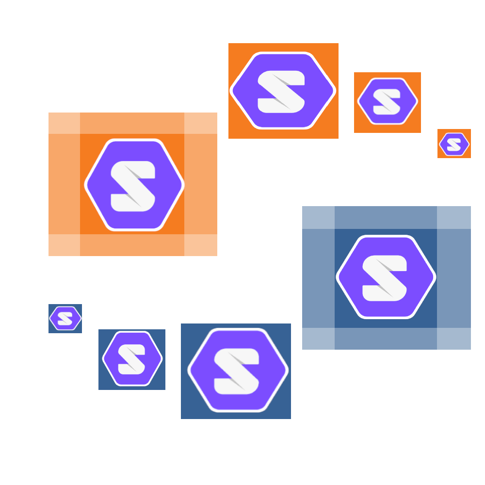

# Solid Linked Open Vocabularies: SolidLoV

This project was created to facilitate and explore the use of [Linked Open Vocabularies](https://lov.linkeddata.es/dataset/lov) with [Solid Pods](https://solidproject.org/)

## Summary

  - [Assumptions](#Assumptions)
  - [Goals](#Goals)
  - [Dependencies](#Dependencies)
  - [Use Cases](#Use-Cases)
  - [Contributing](#Contributing)
  - [License](#License)

## Assumptions

- Disagreement on vocabularies is necessary for human development
- There should be no central source of truth for vocabularies

## Goals

This project is meant to experiment with using linked data vocabularies in a distributed way in order to facilitate work towards common goals while respecting the needs for differences in the meanings and use of common terms.

## Dependencies

- Solid
- ActivityPub

## Use Cases

Coming soon...

## Contributing

Please do!

## License

This project is licensed under the [CC0 1.0 Universal](LICENSE.md)
Creative Commons License - see the [LICENSE.md](LICENSE.md) file for
details

